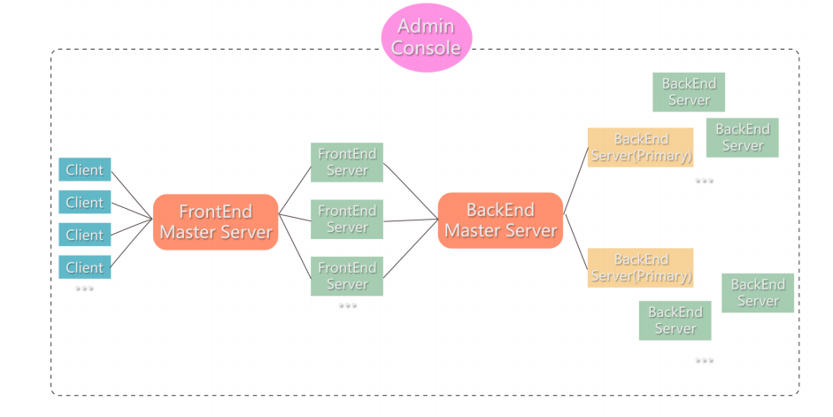

This is the demo github repo for the PennCloud project: Full-Stack Distributed Cloud Platform with Email and Storage Service.

According to the confidential requirements from Penn, we are not sharing the source code and binaries. We attached the final report for design details in this repo, and you can also click [here](https://www.youtube.com/watch?v=CPbpUIeX2to) for a supplemental video for this platform. Thanks!

## Overall Design

Generally, we implemented a distributed cloud platform in which users can register their own accounts, upload/download files, and send/receive emails between both local accounts and outside mailboxes.

## **Team Members and Responsibilities**

Zhijun Zhuang: Admin server, load balancers, replication, log & checkpoint, heartbeats

Zheng Han: UI and API design for User Account / File / Folder / Mail / Admin Console

Bowen Jiang: HTTP servers for User Account / File / Folder / Mail

Wendi Zhang: Key-Value Store, SMTP
